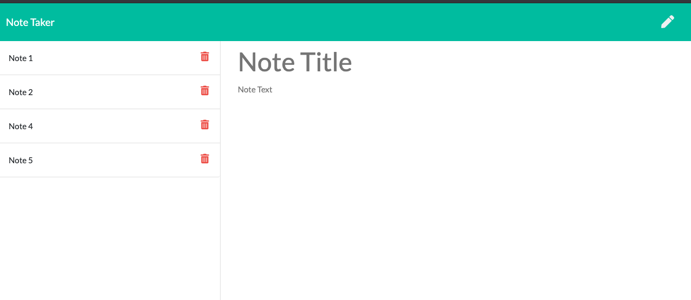

# Note Taker

## Table of Contents
[Description](#desription) 
[Node Dependencies](#node-dependencies) 
[Routes](#routes) 
[Screenshots](#screenshots) 
[Links](#links) 
[Questions](#questions) 

---

## Description
This application can be used to write, save, and delete notes. This application will use an express backend,and will save and retrieve note data from a JSON file.

---
## Node Dependencies
The following node.js packages were installed in the application.
1. **package.json** to keep track of dependencies
2. **express** to use express.js server
3. **path** to read/write files 
4. **nodemon** for testing
5. **uuid** to add unique ID to notes

---
## Routes
* HTML Routes
    * GET `*` returns the index.html file
    * GET `/notes` returns the notes.html file
* API Routes
    *   GET `/api/notes` reads the `db.json` file and returns all saved notes as JSON
    * POST `/api/notes` receives a new note to save on the request body, adds it to the `db.json` file, and then returns the new note to the client.
    * DELETE `/api/notes/:id` receives a query parameter containing the id of a note to delete. It will read all notes from the `db.json` file, remove the note with the given `id` property, and then rewrite the notes to the `db.json` file.

---
## Screenshots

---

## Links 
* Demo of the [app](https://drive.google.com/file/d/1z5Y9EPyfVYyNAQuWpl5vW1k0sFWMVUgd/view) 
* Github [repo](https://github.com/FSGeoff/note-taker.git)

## Questions
Please feel free to contact me with any questions. 
Geoff Nix 
FullStackGeoff@gmail.com 
(347)727-1956
